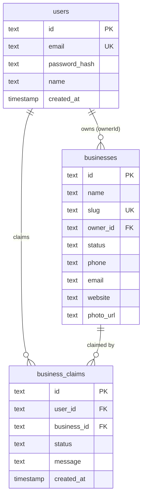

# feat: Admin RBAC with Business Claiming Flow

## Overview

Add two-tier access control to BisDak: business owners can claim pre-seeded listings and edit all fields via the dashboard, while super admin retains full access through the existing `ADMIN_TOKEN` cookie. Includes a self-service claiming flow with automatic approval when the user's email matches the business email on file.

## Problem Statement

BisDak has ~hundreds of scraped business listings with no `ownerId`. Business owners have no way to:
- Claim their listing
- Edit their business details (phone, website, description, photo, etc.)
- Manage their presence on the directory

The admin panel uses a single shared token — there's no way for business owners to self-service their listings.

## Proposed Solution

### Two Access Tiers (No Role Column Needed)

| Tier | Auth Method | Scope |
|------|------------|-------|
| **Super admin** | `ADMIN_TOKEN` cookie (unchanged) | Full access: submissions, claims, reviews, posts, all businesses |
| **Business owner** | NextAuth session + `ownerId` match | Edit own business, respond to reviews |

### Claiming Flow

```
User visits /business/[slug] (unclaimed listing)
  → Sees "Claim this business" button (only if logged in + no ownerId)
  → Clicks → POST /api/claims
  → Server checks: user.email === business.email?
    YES → auto-approve, set ownerId, redirect to /dashboard
    NO  → create business_claims record (pending), show "Claim submitted for review"
  → Admin sees pending claims in /admin panel
  → Admin approves → set ownerId
  → Admin rejects → update status to rejected
```

## Technical Approach

### Phase 1: Database — New `business_claims` Table

Add schema and migration for claims tracking.

#### `lib/db/schema.ts` — add businessClaims table

```typescript
export const businessClaims = pgTable('business_claims', {
  id: text('id').primaryKey().$defaultFn(() => crypto.randomUUID()),
  userId: text('user_id').notNull().references(() => users.id),
  businessId: text('business_id').notNull().references(() => businesses.id),
  status: text('status', { enum: ['pending', 'approved', 'rejected'] }).default('pending'),
  message: text('message'),
  createdAt: timestamp('created_at').defaultNow(),
})
```

#### Migration

```sql
CREATE TABLE business_claims (
  id TEXT PRIMARY KEY,
  user_id TEXT NOT NULL REFERENCES users(id),
  business_id TEXT NOT NULL REFERENCES businesses(id),
  status TEXT NOT NULL DEFAULT 'pending',
  message TEXT,
  created_at TIMESTAMP DEFAULT NOW()
);
CREATE INDEX idx_claims_status ON business_claims(status);
CREATE UNIQUE INDEX idx_claims_user_business ON business_claims(user_id, business_id);
```

**Key constraint:** `UNIQUE(user_id, business_id)` prevents duplicate claims from same user.

### Phase 2: Claiming API — `app/api/claims/route.ts`

```typescript
// POST /api/claims
// Body: { businessId: string, message?: string }
// Auth: NextAuth session required

// Flow:
// 1. Validate session exists
// 2. Validate businessId exists and has no ownerId
// 3. Check no existing pending claim from this user for this business
// 4. Check if user.email === business.email → auto-approve
//    - If match: UPDATE businesses SET owner_id = userId WHERE id = businessId AND owner_id IS NULL
//    - The AND owner_id IS NULL prevents race conditions (two users claiming simultaneously)
// 5. If no match: INSERT into business_claims with status 'pending'
// 6. Return { status: 'approved' | 'pending' }
```

**Security: IDOR + Race condition prevention:**
```typescript
// Atomic claim — prevents two users claiming simultaneously
const result = await db
  .update(businesses)
  .set({ ownerId: userId })
  .where(and(
    eq(businesses.id, businessId),
    isNull(businesses.ownerId)  // Only claim if unclaimed
  ))
  .returning({ id: businesses.id })

if (result.length === 0) {
  // Already claimed by someone else
  return Response.json({ error: 'Business already claimed' }, { status: 409 })
}
```

### Phase 3: Business Edit API — `app/api/businesses/[slug]/edit/route.ts`

```typescript
// PUT /api/businesses/[slug]/edit
// Auth: NextAuth session required
// Body: { name, description, phone, email, website, facebookUrl, googleMapsUrl, photoUrl, openStatus }

// Flow:
// 1. Validate session
// 2. Load business by slug
// 3. Verify business.ownerId === session.user.id (CRITICAL — prevents IDOR)
// 4. Validate + sanitize all fields
// 5. UPDATE businesses SET ... WHERE id = biz.id AND owner_id = session.user.id
//    (double-check ownership in the WHERE clause for defense in depth)
// 6. Redirect to /dashboard
```

**Allowed fields (whitelist — never pass raw body to DB):**
```typescript
const EDITABLE_FIELDS = [
  'name', 'description', 'phone', 'email', 'website',
  'facebookUrl', 'googleMapsUrl', 'photoUrl', 'openStatus',
] as const
```

**Validation rules:**
| Field | Validation |
|-------|-----------|
| name | Required, max 200 chars, trim |
| description | Optional, max 500 chars, trim |
| phone | Optional, max 30 chars, trim |
| email | Optional, valid email format, max 100 chars |
| website | Optional, valid URL (https), max 500 chars |
| facebookUrl | Optional, valid URL (https), max 500 chars |
| googleMapsUrl | Optional, valid URL (https), max 500 chars |
| photoUrl | Optional, valid URL (https), max 500 chars |
| openStatus | Optional, enum: 'open' \| 'closed' \| null |

### Phase 4: Admin Claims Management — `app/api/admin/claims/[id]/route.ts`

```typescript
// POST /api/admin/claims/[id]
// Auth: ADMIN_TOKEN cookie (same pattern as submissions)
// Body: { status: 'approved' | 'rejected' }

// Flow:
// 1. Validate admin auth (isAuthorized pattern from existing code)
// 2. Load claim + business
// 3. If approved:
//    - UPDATE businesses SET owner_id = claim.userId WHERE id = claim.businessId AND owner_id IS NULL
//    - UPDATE business_claims SET status = 'approved'
// 4. If rejected:
//    - UPDATE business_claims SET status = 'rejected'
// 5. Redirect to /admin
```

### Phase 5: UI Changes

#### 5a. Business Detail Page — "Claim this business" button

**File:** `app/business/[slug]/page.tsx`

Add a "Claim this business" button visible when:
- User is logged in (NextAuth session exists)
- Business has no `ownerId`
- User doesn't already have a pending claim for this business

```tsx
// New client component: components/ClaimButton.tsx
// Props: { businessId: string, businessSlug: string }
// Shows "Claim this business" button
// On click: POST /api/claims with businessId
// On success: redirect to /dashboard or show "pending review" message
```

#### 5b. Dashboard — Edit Business Form

**File:** `app/dashboard/page.tsx` (modify existing)

Add an "Edit" button next to each owned listing that links to `/dashboard/edit/[slug]`.

**New file:** `app/dashboard/edit/[slug]/page.tsx`

```tsx
// Server component that:
// 1. Checks NextAuth session
// 2. Loads business by slug WHERE ownerId = session.user.id
// 3. If not owned → redirect to /dashboard
// 4. Renders form pre-filled with current values
// 5. Form POSTs to /api/businesses/[slug]/edit
```

**Form fields:** name, description, phone, email, website, facebookUrl, googleMapsUrl, photoUrl (URL input), openStatus (select: open/closed/not set), categoryId (select), regionId (select).

#### 5c. Dashboard — Claim Status

Show pending claims on the dashboard so users know their claim is being reviewed.

```tsx
// Query: SELECT * FROM business_claims WHERE userId = session.user.id AND status = 'pending'
// Display: "Your claim for [Business Name] is pending admin review"
```

#### 5d. Admin Panel — Pending Claims Section

**File:** `app/admin/page.tsx` (modify existing)

Add a "Pending Claims" section between submissions and blog posts:

```tsx
// Query: SELECT claims.*, businesses.name, users.email, users.name
//        FROM business_claims claims
//        JOIN businesses ON claims.businessId = businesses.id
//        JOIN users ON claims.userId = users.id
//        WHERE claims.status = 'pending'
// Display: user name, user email, business name, claim message
// Actions: Approve / Reject buttons (same pattern as submissions)
```

#### 5e. Fix: Review Response Auth

**File:** `app/api/reviews/[id]/respond/route.ts`

**Bug:** Currently any authenticated user can respond to any review. Add ownership check:

```typescript
// Before updating, verify the review belongs to a business owned by the user
const [review] = await db.select().from(reviews).where(eq(reviews.id, id))
const [biz] = await db.select().from(businesses)
  .where(and(eq(businesses.id, review.businessId), eq(businesses.ownerId, session.user.id)))
if (!biz) return new Response('Forbidden', { status: 403 })
```

## New Files

| File | Purpose |
|------|---------|
| `app/api/claims/route.ts` | POST — create claim (auto-approve on email match) |
| `app/api/admin/claims/[id]/route.ts` | POST — admin approve/reject claim |
| `app/api/businesses/[slug]/edit/route.ts` | PUT — owner edits business |
| `app/dashboard/edit/[slug]/page.tsx` | Edit business form page |
| `components/ClaimButton.tsx` | Client component — claim this business |

## Modified Files

| File | Change |
|------|--------|
| `lib/db/schema.ts` | Add `businessClaims` table |
| `app/business/[slug]/page.tsx` | Add ClaimButton for unclaimed businesses |
| `app/dashboard/page.tsx` | Add Edit button per listing + pending claims display |
| `app/admin/page.tsx` | Add Pending Claims section |
| `app/api/reviews/[id]/respond/route.ts` | Fix: add ownership validation |

## ERD



## Security Considerations

1. **IDOR prevention:** All edit/claim APIs verify `ownerId === session.user.id` in both application logic AND SQL WHERE clause (defense in depth)
2. **Race conditions:** Atomic `UPDATE ... WHERE owner_id IS NULL` prevents two users claiming the same business
3. **Input validation:** Whitelist editable fields, validate formats, enforce max lengths
4. **SSRF prevention:** Validate photoUrl is HTTPS before storing (existing pattern from OG endpoint)
5. **Review response auth fix:** Add ownership check to prevent any user responding as any business
6. **Duplicate claims:** UNIQUE constraint on `(user_id, business_id)` in business_claims table

## Acceptance Criteria

- [x] New `business_claims` table exists with migration
- [x] Logged-in users see "Claim this business" on unclaimed listings
- [x] Email-match claims are auto-approved (ownerId set immediately)
- [x] Non-match claims go to admin queue as pending
- [x] Admin panel shows pending claims with approve/reject buttons
- [x] Approving a claim sets the business ownerId
- [x] Dashboard shows "Edit" button for owned listings
- [x] Edit form loads pre-filled and saves all business fields
- [x] Edit API validates ownership (returns 403 if not owner)
- [x] Duplicate claims from same user are prevented
- [x] Race condition: two simultaneous claims result in only one winner
- [x] Review response API validates business ownership
- [x] `npx next build` passes clean

## References

- Brainstorm: `docs/brainstorms/2026-05-09-admin-rbac-business-claiming-brainstorm.md`
- Existing admin auth pattern: `app/admin/page.tsx:12-17`
- Existing submission approve pattern: `app/api/admin/submissions/[id]/route.ts`
- Dashboard: `app/dashboard/page.tsx`
- NextAuth config: `auth.ts`
- DB schema: `lib/db/schema.ts`
- Review respond (needs auth fix): `app/api/reviews/[id]/respond/route.ts`
