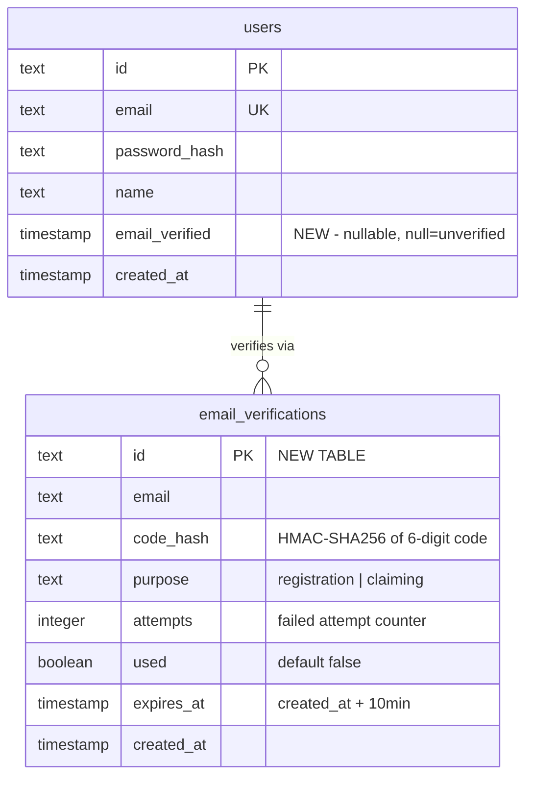

# feat: Email OTP Verification at Registration and Claiming

## Overview

Add email verification via 6-digit OTP code at two points: registration (account activation) and business claiming (re-verification). OTP delivery via Resend API. Unverified users are blocked from all authenticated actions.

## Problem Statement

Currently, anyone can register with any email and immediately access all features. This allows fake accounts to pollute reviews, claim businesses they don't own, and degrade data quality. There is no proof that a user controls the email they registered with.

## Proposed Solution

1. Add `emailVerified` boolean to `users` table (default `false`)
2. Create `email_verifications` table to store hashed OTP codes
3. After registration, redirect to `/auth/verify` where user enters a 6-digit code sent to their email
4. Block all authenticated actions (dashboard, reviews, claiming) until `emailVerified = true`
5. At claiming, require a fresh OTP verification before processing the claim
6. Use Resend API for email delivery

## Schema Changes

### ERD



### `lib/db/schema.ts` changes

Add `emailVerified` to `users` as **nullable timestamp** (matches NextAuth DrizzleAdapter convention — `null` = unverified, timestamp = verified):
```typescript
emailVerified: timestamp('email_verified'),
```

Add new `emailVerifications` table:
```typescript
export const emailVerifications = pgTable('email_verifications', {
  id: text('id').primaryKey().$defaultFn(() => crypto.randomUUID()),
  email: text('email').notNull(),
  codeHash: text('code_hash').notNull(),
  purpose: text('purpose', { enum: ['registration', 'claiming'] }).notNull(),
  attempts: integer('attempts').default(0),
  used: boolean('used').default(false),
  expiresAt: timestamp('expires_at').notNull(),
  createdAt: timestamp('created_at').defaultNow(),
})
```

### Migration for existing users

After schema push, run SQL to grandfather all existing users as verified:
```sql
UPDATE users SET email_verified = NOW() WHERE email_verified IS NULL;
```

Run `drizzle-kit push` after schema changes.

## Technical Approach

### Phase 1: Foundation (Resend + OTP utilities)

#### 1a. Install Resend SDK

```bash
npm install resend
```

Add `RESEND_API_KEY` to `.env.local` and Vercel env vars.

#### 1b. Create `lib/email.ts` — Resend client + send OTP

```typescript
import { Resend } from 'resend'
import crypto from 'crypto'

const resend = new Resend(process.env.RESEND_API_KEY)

// Use crypto.randomInt for CSPRNG (not Math.random)
export function generateOTP(): { code: string; hash: string } {
  const code = String(crypto.randomInt(100000, 999999))
  const hash = hashOTP(code)
  return { code, hash }
}

// HMAC-SHA256 with server secret (prevents offline brute-force of 6-digit keyspace)
export function hashOTP(code: string): string {
  return crypto.createHmac('sha256', process.env.OTP_HMAC_SECRET!)
    .update(code).digest('hex')
}

// Timing-safe comparison for OTP hashes
export function verifyOTPHash(submitted: string, stored: string): boolean {
  const a = Buffer.from(submitted, 'hex')
  const b = Buffer.from(stored, 'hex')
  if (a.length !== b.length) return false
  return crypto.timingSafeEqual(a, b)
}

export async function sendOTPEmail(email: string, code: string) {
  const { error } = await resend.emails.send({
    from: 'BisDak <noreply@bisdak.co.nz>',
    to: email,
    subject: 'Your BisDak verification code',
    html: `<div style="font-family: Arial, sans-serif; max-width: 480px; margin: 0 auto;">
      <h2 style="color: #333;">Your verification code</h2>
      <p style="font-size: 32px; font-family: monospace; letter-spacing: 8px; font-weight: bold; color: #111;">${code}</p>
      <p style="color: #666;">This code expires in 10 minutes.</p>
      <p style="color: #666;">If you did not request this code, please ignore this email.</p>
      <hr style="border: none; border-top: 1px solid #eee; margin: 24px 0;" />
      <p style="color: #999; font-size: 12px;">BisDak - Pinoy Business Hub NZ</p>
    </div>`,
  })
  if (error) throw new Error(`Failed to send OTP: ${error.message}`)
}
```

Add `OTP_HMAC_SECRET` to `.env.local` and Vercel env vars (generate with `openssl rand -hex 32`).

#### 1c. Create `lib/otp.ts` — OTP creation + verification logic

```typescript
import { db } from '@/lib/db'
import { emailVerifications } from '@/lib/db/schema'
import { eq, and, gt, sql } from 'drizzle-orm'
import { generateOTP, hashOTP, verifyOTPHash, sendOTPEmail } from '@/lib/email'

export async function createAndSendOTP(email: string, purpose: 'registration' | 'claiming') {
  // Rate limit: max 3 per email per hour (includes initial send)
  const oneHourAgo = new Date(Date.now() - 60 * 60 * 1000)
  const recentCount = await db
    .select({ count: sql<number>`count(*)` })
    .from(emailVerifications)
    .where(and(
      eq(emailVerifications.email, email),
      gt(emailVerifications.createdAt, oneHourAgo)
    ))

  if (recentCount[0].count >= 3) {
    return { error: 'Too many requests. Try again later.' }
  }

  // Invalidate all previous unused codes for this email+purpose
  await db
    .update(emailVerifications)
    .set({ used: true })
    .where(and(
      eq(emailVerifications.email, email),
      eq(emailVerifications.purpose, purpose),
      eq(emailVerifications.used, false)
    ))

  const { code, hash } = generateOTP()
  const expiresAt = new Date(Date.now() + 10 * 60 * 1000) // 10 minutes

  await db.insert(emailVerifications).values({
    email,
    codeHash: hash,
    purpose,
    expiresAt,
  })

  await sendOTPEmail(email, code)
  return { success: true }
}

export async function verifyOTP(email: string, code: string, purpose: 'registration' | 'claiming') {
  const now = new Date()

  // Find the latest unused, non-expired OTP for this email+purpose
  const [record] = await db
    .select()
    .from(emailVerifications)
    .where(and(
      eq(emailVerifications.email, email),
      eq(emailVerifications.purpose, purpose),
      eq(emailVerifications.used, false),
      gt(emailVerifications.expiresAt, now)
    ))
    .orderBy(sql`created_at DESC`)
    .limit(1)

  if (!record) {
    return { error: 'No active code. Request a new one.' }
  }

  // Check max attempts (5) before even comparing
  if (record.attempts! >= 5) {
    await db
      .update(emailVerifications)
      .set({ used: true })
      .where(eq(emailVerifications.id, record.id))
    return { error: 'Too many failed attempts. Request a new code.' }
  }

  // Timing-safe hash comparison
  const submittedHash = hashOTP(code)
  if (!verifyOTPHash(submittedHash, record.codeHash)) {
    // Increment attempts
    await db
      .update(emailVerifications)
      .set({ attempts: sql`attempts + 1` })
      .where(eq(emailVerifications.id, record.id))

    const remaining = 4 - record.attempts!
    if (remaining <= 0) {
      await db
        .update(emailVerifications)
        .set({ used: true })
        .where(eq(emailVerifications.id, record.id))
      return { error: 'Too many failed attempts. Request a new code.' }
    }

    return { error: `Invalid code. ${remaining} attempt(s) remaining.` }
  }

  // Atomic consumption — mark as used
  const [consumed] = await db
    .update(emailVerifications)
    .set({ used: true })
    .where(and(
      eq(emailVerifications.id, record.id),
      eq(emailVerifications.used, false)
    ))
    .returning({ id: emailVerifications.id })

  if (!consumed) {
    return { error: 'Code already used. Request a new one.' }
  }

  return { success: true, verifiedAt: now }
}
```

### Phase 2: Registration Flow

#### 2a. Modify `app/api/auth/register/route.ts`

After inserting the user, create and send an OTP instead of redirecting to sign-in:

```typescript
// After db.insert(users)...
await createAndSendOTP(email, 'registration')
return Response.redirect(new URL(`/auth/verify?email=${encodeURIComponent(email)}`, request.url))
```

Note: Email is passed via query parameter. The verify page displays it masked (e.g., `j***@example.com`).

#### 2b. Create `app/auth/verify/page.tsx`

- Single text input for 6-digit code (supports paste)
- Shows masked email from query param
- "Resend code" button (posts to `/api/auth/resend-otp`)
- Error/success messages via query params
- If user is already verified (`emailVerified !== null`), redirect to `/dashboard`
- Posts to `/api/auth/verify-otp`

#### 2c. Create `app/api/auth/verify-otp/route.ts`

```typescript
// POST handler:
// 1. Extract email + code from form data
// 2. Call verifyOTP(email, code, 'registration')
// 3. If success: UPDATE users SET email_verified = NOW() WHERE email = ...
// 4. Redirect to /auth/sign-in?verified=1
// 5. If error: redirect to /auth/verify?email=...&error=invalid
```

#### 2d. Create `app/api/auth/resend-otp/route.ts`

```typescript
// POST handler:
// 1. Extract email from form data
// 2. Call createAndSendOTP(email, 'registration')
// 3. Always return same response (prevent email enumeration)
// 4. Redirect to /auth/verify?email=...&resent=1
```

### Phase 3: Block Unverified Users

#### 3a. Update `proxy.ts` middleware

Add `/auth/verify` to the allowed paths. For all protected routes, check `emailVerified`:

```typescript
export default auth(async (req) => {
  const isLoggedIn = !!req.auth
  const isAdmin = req.cookies.get('admin_session')?.value === (process.env.ADMIN_TOKEN ?? '').trim()
  const isDashboard = req.nextUrl.pathname.startsWith('/dashboard')

  if (isDashboard && !isLoggedIn && !isAdmin) {
    return NextResponse.redirect(new URL('/auth/sign-in', req.url))
  }

  // If logged in but not verified, redirect to verify page
  if (isLoggedIn && req.auth?.user?.emailVerified === false) {
    const isVerifyPage = req.nextUrl.pathname.startsWith('/auth/verify')
    if (!isVerifyPage && isDashboard) {
      return NextResponse.redirect(new URL(`/auth/verify?email=${encodeURIComponent(req.auth.user.email!)}`, req.url))
    }
  }
})

export const config = {
  matcher: ['/dashboard/:path*'],
}
```

#### 3b. Update `auth.ts` — add `emailVerified` to JWT/session

Allow unverified users to sign in (so they can access /auth/verify), but propagate status:

```typescript
// In authorize callback, include emailVerified:
return { id: user.id, email: user.email, name: user.name, emailVerified: user.emailVerified }

// In jwt callback:
if (user) { token.id = user.id; token.emailVerified = user.emailVerified }

// In session callback:
session.user.emailVerified = token.emailVerified as Date | null
```

Update `types/next-auth.d.ts` to extend the session user type with `emailVerified: Date | null`.

#### 3c. Handle unverified user sign-in

Update `app/auth/sign-in/actions.ts` — after successful sign-in, if `emailVerified` is null:
1. Send a new OTP via `createAndSendOTP(email, 'registration')`
2. Redirect to `/auth/verify?email=...` instead of `/dashboard`

#### 3d. Guard API routes

Add `emailVerified` check to:
- `app/api/businesses/[slug]/edit/route.ts` (for non-admin users)
- `app/api/reviews/route.ts` (currently has no auth check — add auth + verification)
- `app/api/claims/route.ts` (business claim endpoint)

### Phase 4: Claiming Re-verification

#### 4a. Modify claim flow

When user clicks "Claim this business":
1. Send OTP to user's registered email
2. Show OTP input form
3. Verify OTP was confirmed within last 5 minutes (server-side)
4. Process claim only after verification

#### 4b. Create `app/api/claims/verify/route.ts`

```typescript
// 1. Get authenticated user
// 2. Call createAndSendOTP(user.email, 'claiming')
// 3. Return success (front-end shows OTP input)
```

#### 4c. Update claim submission endpoint

```typescript
// Before processing claim:
// 1. Check email_verifications for a 'claiming' record
//    WHERE email = user.email AND used = true AND created_at > NOW() - 5 minutes
// 2. If no recent verification, reject with error
```

## Security Implementation

| Attack Vector | Mitigation |
|---|---|
| Brute force OTP | Max 5 failed attempts per code, then invalidate. Show remaining attempts. |
| OTP flooding | 3 requests/email/hour rate limit (includes initial send) |
| Email enumeration | Always return same response for resend endpoint |
| Code in DB leak | HMAC-SHA256 with server secret (`OTP_HMAC_SECRET`) — prevents offline brute-force of 6-digit keyspace |
| Timing attack | `crypto.timingSafeEqual()` for hash comparison |
| Weak randomness | `crypto.randomInt()` (CSPRNG), not `Math.random()` |
| Race condition | Atomic `UPDATE ... WHERE used = false RETURNING id` |
| Old code reuse | Check `expires_at > NOW()` AND `used = false` |
| Multiple active codes | Invalidate all previous codes on resend |
| Claiming bypass | Server-side timestamp check within 5 minutes |

### Environment Variables Required

| Variable | Purpose |
|---|---|
| `RESEND_API_KEY` | Resend email API key |
| `OTP_HMAC_SECRET` | HMAC key for OTP hashing (generate: `openssl rand -hex 32`) |

## Acceptance Criteria

- [x] New user cannot access dashboard until email is verified
- [x] 6-digit OTP is sent to user's email after registration
- [x] OTP expires after 10 minutes
- [x] Max 5 failed attempts per code before invalidation (with remaining attempts shown)
- [x] Max 3 OTP requests per email per hour (includes initial send)
- [x] User can resend OTP code from verify page
- [x] Resending invalidates all previous unused codes
- [x] Verified users have `emailVerified` timestamp set in database
- [x] Existing users are grandfathered as verified on deployment
- [x] Unverified users who sign in are redirected to /auth/verify
- [x] Business claiming requires fresh OTP verification
- [x] Claim OTP verified inline during claim submission
- [x] Super admin bypasses all verification requirements
- [x] Same response returned regardless of email existence (anti-enumeration)
- [x] OTP codes stored as HMAC-SHA256 hashes with server secret
- [x] Timing-safe comparison used for OTP verification
- [x] OTP generated with `crypto.randomInt()` (CSPRNG)
- [ ] Already-verified users are redirected away from /auth/verify

## Files to Create

| File | Purpose |
|---|---|
| `lib/email.ts` | Resend client, OTP generation, email sending |
| `lib/otp.ts` | OTP create/verify logic with rate limiting |
| `app/auth/verify/page.tsx` | OTP input form page |
| `app/api/auth/verify-otp/route.ts` | Verify OTP and activate account |
| `app/api/auth/resend-otp/route.ts` | Resend OTP with rate limiting |
| `app/api/claims/verify/route.ts` | Send claiming OTP |

## Files to Modify

| File | Change |
|---|---|
| `lib/db/schema.ts` | Add `emailVerified` (timestamp) to users, add `emailVerifications` table |
| `app/api/auth/register/route.ts` | Send OTP after registration, redirect to verify |
| `auth.ts` | Include `emailVerified` in JWT and session |
| `types/next-auth.d.ts` | Extend session user type with `emailVerified` |
| `proxy.ts` | Redirect unverified users to `/auth/verify` |
| `app/auth/sign-in/actions.ts` | Redirect unverified users to /auth/verify with new OTP |
| `app/api/businesses/[slug]/edit/route.ts` | Guard with `emailVerified` check |
| `app/api/reviews/route.ts` | Add auth + `emailVerified` check |
| `app/api/claims/route.ts` | Add OTP verification step |

## Dependencies

- **Resend API key** — sign up at resend.com, add domain verification for `bisdak.co.nz`
- **Environment variables**: `RESEND_API_KEY`, `OTP_HMAC_SECRET` in `.env.local` and Vercel

## Implementation Order

1. Schema changes + `drizzle-kit push` + existing user migration SQL
2. Add env vars (`RESEND_API_KEY`, `OTP_HMAC_SECRET`) to `.env.local` and Vercel
3. `npm install resend`
4. `lib/email.ts` + `lib/otp.ts`
5. Auth updates — `auth.ts` (JWT/session), `types/next-auth.d.ts`
6. Registration flow — register route + verify page + verify-otp route + resend-otp route
7. Sign-in flow — redirect unverified to /auth/verify
8. Middleware updates — proxy.ts
9. API route guards — edit, reviews, claims
10. Claiming re-verification flow
11. Test end-to-end

## Key Decisions from Research

- **`emailVerified` is a nullable timestamp, not boolean** — matches NextAuth DrizzleAdapter convention
- **HMAC-SHA256 over plain SHA-256** — server secret prevents offline brute-force of 6-digit keyspace
- **`crypto.randomInt()` over `Math.random()`** — cryptographically secure random number generation
- **`crypto.timingSafeEqual()` for hash comparison** — prevents timing side-channel attacks
- **Unverified users CAN sign in** — but are redirected to /auth/verify. This lets them make authenticated resend requests.
- **Resend invalidates all previous codes** — prevents attacker from using intercepted earlier codes
- **Existing users are grandfathered** — migration sets `email_verified = NOW()` for all current users
- **Email passed via query param** — verify page masks it for display (e.g., `j***@example.com`)
- **Reviews now require auth** — this is a behavioral change from the current open-to-all model

## References

- Brainstorm: `docs/brainstorms/2026-05-09-email-otp-verification-brainstorm.md`
- Auth config: `auth.ts`
- Registration: `app/api/auth/register/route.ts`
- Middleware: `proxy.ts`
- Schema: `lib/db/schema.ts`
- Resend docs: https://resend.com/docs
