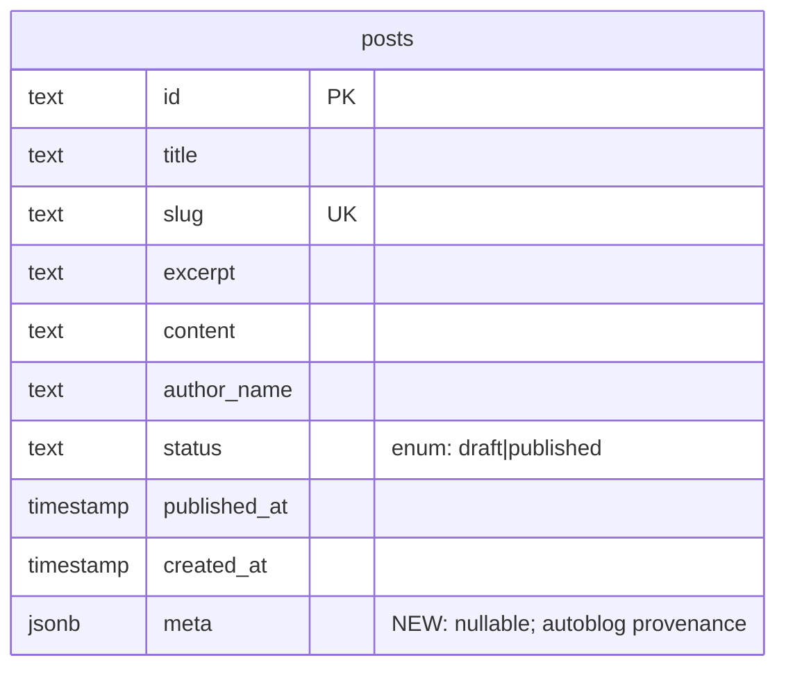

# ✨ Port InspectPro's Autoblog to BisDak

## Overview

Port `inspectpro-v2-web/autoblog` (a Python content pipeline) into BisDak as a
top-level `autoblog/` directory, deployed as a second install on the same VPS.
The pipeline's shape — discover → write (Claude Sonnet draft + Opus review) →
publish → notify, cron-driven — is reused. The two substantive changes:

1. **Publisher**: git-commit-MDX is replaced with a direct Postgres `INSERT`
   into BisDak's `posts` table via `psycopg`. Posts land as `status='draft'`
   for human approval.
2. **Content**: prompts, topic-discovery sources, and keyword strategy are
   rewritten for Filipino-NZ community news + NZ jobs/visa/employment content.

A handful of pre-flight changes to BisDak itself are required to make this
work safely: a small `posts.meta jsonb` column for provenance, a modest
renderer upgrade (lists + blockquotes), and new admin endpoints/UI to
publish/unpublish/edit/delete posts (the current admin only lists them).

## Problem Statement

BisDak has a `posts` table and a public blog at `/blog`, but no content
production system. Three existing posts are hand-seeded. To grow community
reach the blog needs a sustainable content stream — ~20 drafts/week — without
hiring a writer. InspectPro has a proven Python autoblog doing exactly this
shape of work; reusing it is cheaper and faster than building from scratch.

The fit is non-trivial: InspectPro publishes by committing MDX files to git
and relying on Vercel auto-deploy; BisDak reads posts from Postgres via a
custom in-page markdown renderer. The pipeline's content side
(prompts/sources) is also entirely InspectPro-specific.

## Proposed Solution

Three components ship in coordinated phases:

1. **BisDak app changes (Phase 0)** — schema migration for `posts.meta`,
   modest blog renderer upgrade, admin endpoints + per-post review page.
2. **Python autoblog port (Phases 1-2)** — copy the pipeline, rewrite the
   publisher for Postgres, rewrite prompts/sources for the new domain, add
   safety rails (kill switch, citation gate, link health, disclaimer).
3. **VPS deployment (Phase 3)** — second-install pattern at
   `/opt/bisdak-autoblog`, isolated venv/.env/logs/locks, cron entries.

## Technical Approach

### Architecture

```
┌─────────────── VPS (existing, also hosts InspectPro autoblog) ─────────────┐
│                                                                            │
│  /opt/bisdak-autoblog/                                                     │
│  ├── .venv/                                                                │
│  ├── .env  (DATABASE_URL pooler, ANTHROPIC_API_KEY, RESEND_API_KEY,        │
│  │          AUTOBLOG_PUBLISH_ENABLED, AUTOBLOG_DISCOVER_ENABLED,           │
│  │          ANTHROPIC_DAILY_BUDGET_USD, NOTIFY_EMAIL, …)                   │
│  ├── config.toml                                                           │
│  ├── data/bisdak_autoblog.sqlite   (separate file from InspectPro)         │
│  ├── autoblog/                                                             │
│  │   ├── discover.py                                                       │
│  │   ├── writer.py                                                         │
│  │   ├── reviewer.py                                                       │
│  │   ├── publisher.py   ◄── rewritten: psycopg INSERT into bisdak.posts    │
│  │   ├── notifier.py    ◄── Resend, points to bisdak admin                 │
│  │   ├── llm.py / db.py / config.py / link_checker.py                      │
│  │   └── prompts/       ◄── all 4 rewritten                                │
│  └── run.sh                                                                │
│                                                                            │
│  /var/log/bisdak-autoblog/   /var/lib/bisdak-autoblog/*.lock               │
└────────────────────────────────────────────────────────────────────────────┘
                                  │ psycopg over TLS, prepare_threshold=None
                                  ▼
            ┌────────────── Supabase Postgres (transaction pooler :6543) ────┐
            │  posts (id, title, slug, excerpt, content, author_name,        │
            │         status='draft', published_at, created_at, meta jsonb)  │
            └────────────────────────────────────────────────────────────────┘
                                  │
                                  ▼
            ┌────────────── BisDak (Vercel, Next.js 16) ─────────────────────┐
            │  app/blog/page.tsx          (ISR 300s, filter status=published)│
            │  app/blog/[slug]/page.tsx   (renderer + revalidate=300)        │
            │  app/admin/posts/[id]/page.tsx  ◄ NEW: per-post review         │
            │  app/api/admin/posts/[id]/{publish,unpublish,delete}/route.ts  │
            │     ◄ NEW: status flips + revalidatePath                       │
            └────────────────────────────────────────────────────────────────┘
```

### ERD — minimal schema change



`posts.meta` is an additive, nullable column. Existing rows are unaffected.
Shape when populated by autoblog:

```json
{
  "source": "autoblog",
  "source_urls": ["https://rnz.co.nz/...", "https://immigration.govt.nz/..."],
  "topic_score": 78,
  "draft_model": "claude-sonnet-4-6",
  "review_model": "claude-opus-4-7",
  "review_revisions": 1,
  "generated_at": "2026-05-11T03:14:00Z",
  "risk_flags": ["mentions_immigration"]
}
```

### Implementation Phases

#### Phase 1: BisDak app pre-flight

**Goal:** make BisDak ready to receive autoblog drafts safely. No Python yet.

##### 1.1 — Schema migration: add `posts.meta jsonb`

Files:
- `lib/db/schema.ts:75-85` — add `meta: jsonb('meta')` (nullable, no default)
- `drizzle/0001_add_posts_meta.sql` — generated migration

```ts
// lib/db/schema.ts
export const posts = pgTable('posts', {
  // ...existing fields
  meta: jsonb('meta'),  // nullable; autoblog provenance only
})
```

```sql
-- drizzle/0001_add_posts_meta.sql
ALTER TABLE "posts" ADD COLUMN "meta" jsonb;
```

**Why nullable jsonb, not a structured side table:** the only writer is the
autoblog; the only reader is the admin review page. No JOINs needed. Schema
churn cost is one column.

##### 1.2 — Renderer upgrade: lists + blockquotes

Files:
- `app/blog/[slug]/page.tsx:19-54` — extend `renderContent`

Add two line-level rules **before** the existing paragraph fallthrough:

- Line matches `/^- (.+)$/` → `<li>`. Consecutive `<li>` lines group into a
  single `<ul>`.
- Line matches `/^> (.+)$/` → `<blockquote>`.

XSS: escape via existing `escapeHtml` before substitution, identical to the
paragraph branch. Total addition: ~35 lines.

**Why these two and not full markdown:** lists are the single most missed
feature for "5 things to know" style posts; blockquotes let citations stand
out. Code blocks, tables, images are not needed for this content domain. If
those become necessary later, swap to `react-markdown` + `rehype-sanitize` in
a separate change.

Reject in scope: `## H2` / `### H3` headings — the existing `**Whole Line**`
→ h3 idiom stays. Two heading mechanisms is one too many for a 50-line
parser.

##### 1.3 — Admin endpoints

New route handlers (Next.js 16 App Router — consult
`node_modules/next/dist/docs/` per `AGENTS.md`):

- `app/api/admin/posts/[id]/publish/route.ts` — POST. Auth via existing
  `requireAdmin()` from `lib/admin.ts:10-23`. UPDATE
  `status='published', published_at=NOW()`. Then
  `revalidatePath('/blog')` + `revalidatePath('/blog/${slug}')`. Returns
  `{ ok: true, url }`.
- `app/api/admin/posts/[id]/unpublish/route.ts` — POST. UPDATE
  `status='draft'`. Same revalidation. (Takedown / "demote".)
- `app/api/admin/posts/[id]/route.ts` — DELETE. Hard delete. Same
  revalidation.
- `app/api/admin/posts/[id]/route.ts` — PATCH. Accepts
  `{ title?, excerpt?, content? }`. Re-validates against the same regex used
  in `app/api/admin/posts/route.ts:23`. Same revalidation if `status` was
  `published`.

All four endpoints:
- Require admin cookie (timing-safe SHA-256 match).
- Use the existing `db` client from `lib/db/index.ts`.
- Return 404 if the post doesn't exist; 401 if not admin.

##### 1.4 — Admin per-post review page

New file: `app/admin/posts/[id]/page.tsx`

Server component. Shows for one post:
- Title, slug, status badge, created_at, author_name
- Full body rendered with the **same renderer** as the public page (so
  reviewer sees exactly what readers will see)
- A "Provenance" panel reading `meta` jsonb: source URLs (clickable),
  draft/review model, topic score, revisions, risk_flags
- Action buttons (client-component island): **Publish**, **Edit**,
  **Unpublish** (only if currently published), **Delete**
- Edit opens a `<textarea>` for body + small inputs for title/excerpt;
  submits to PATCH

Deep link `/admin/posts/<id>` works from the Resend email.

##### 1.5 — Admin list: deep-link + status filter

Files:
- `app/admin/page.tsx:312-329` — wrap each post row in a `Link` to
  `/admin/posts/<id>`; add a "filter: drafts only" tab

No new API. Read-only enhancement.

##### 1.6 — `.env.local` security cleanup (out of scope, but flag)

`.env.local` is currently checked in with live secrets per the research
report. Outside the scope of this plan, but **before this autoblog ships**:

- Rotate `DATABASE_URL`, `AUTH_SECRET`, `ADMIN_TOKEN`, `SUPABASE_SERVICE_KEY`,
  `RESEND_API_KEY`, `OTP_HMAC_SECRET`
- Add `.env.local` to `.gitignore`, force-remove from git history with
  `git filter-repo` or BFG
- Create `.env.example` with placeholder values

The autoblog will need its **own** copy of `DATABASE_URL` plus a new
`ANTHROPIC_API_KEY`. Rotate the BisDak DB password and provision a separate
secret store for the VPS `.env`.

##### 1.7 — Acceptance criteria for Phase 1

- [x] Drizzle migration generated (`drizzle/0003_abandoned_sasquatch.sql`); apply step is operator-run
- [x] Renderer renders `- item` as `<ul><li>` and `> quote` as `<blockquote>`
      (verified via PR-description example bodies; live verification via Phase 1.4 admin page)
- [x] Admin endpoints return correct status codes (verified: POST publish
      with cookie → 200; without cookie → 401; round-trip publish/unpublish
      via UI exercises the chain)
- [x] Per-post review page renders title, body, action bar, back link, and
      live-view link (verified via Playwright). Provenance panel is gated on
      `meta` jsonb; existing seeded rows have null `meta`, so panel hidden
      as designed — will render once autoblog Phase 2 starts inserting
      provenance.
- [x] Publishing a draft via the admin button updates the UI (router.refresh)
      and the public `/blog/<slug>` returns 200 immediately after publish
      (revalidatePath honoured in dev)

#### Phase 2: Python autoblog port

**Goal:** copy and rewrite the Python pipeline. Insert drafts into the dev DB
from a local Python run.

##### 2.1 — Copy InspectPro autoblog into BisDak

Source: `/Users/JFSA/Documents/git-projects/inspectpro-v2-web/autoblog/`
Target: `/Users/JFSA/Documents/git-projects/bisdak/autoblog/`

Copy verbatim — files we keep largely intact:

```
autoblog/
├── autoblog/
│   ├── __init__.py
│   ├── config.py        ← edits: new env var names, defaults
│   ├── db.py            ← keep: SQLite for topics/keywords state
│   ├── discover.py      ← edits: new source list, scoring rubric
│   ├── keywords.py      ← edits: new seed keywords
│   ├── link_checker.py  ← keep
│   ├── llm.py           ← keep (Anthropic SDK)
│   ├── main.py          ← edits: command dispatch, kill-switch checks
│   ├── notifier.py      ← edits: bisdak admin URL, subject line
│   ├── publisher.py     ← REWRITE: psycopg INSERT, no git
│   ├── reviewer.py      ← keep (prompt content lives in prompts/)
│   ├── writer.py        ← edits: drop MDX template; emit raw markdown
│   └── prompts/         ← REWRITE all 4 .txt files
├── templates/post.mdx.j2 ← DELETE (no MDX)
├── scripts/bench_llm.py  ← keep
├── config.toml          ← edits: defaults for this install
├── requirements.txt     ← edits: drop gitpython, jinja2; add psycopg[binary]
├── run.sh               ← edits: paths
├── setup.sh             ← edits: paths, drop repo clone step
└── .env.example         ← NEW: documented placeholders
```

##### 2.2 — Rewrite `publisher.py` for direct Postgres

Replace the entire git-pull-write-stage-commit-push-verify flow with:

```python
# autoblog/publisher.py (sketch)
import logging
import psycopg
from psycopg.rows import dict_row
from . import config

logger = logging.getLogger(__name__)

RESERVED_SLUGS = {
    "admin", "api", "auth", "blog", "business", "cookies", "dashboard",
    "disclaimer", "jobs", "privacy", "search", "submit", "terms", "tools",
}

def publish_draft(
    *, title: str, slug: str, excerpt: str, content: str, meta: dict
) -> str:
    """
    Insert a draft post. Returns the post id.
    Retries slug with -2, -3, ..., up to -5 on UniqueViolation.
    Raises QuarantineTopic if exhausted or slug is reserved.
    """
    if slug in RESERVED_SLUGS:
        raise QuarantineTopic(f"slug '{slug}' is reserved")

    candidates = [slug] + [f"{slug}-{i}" for i in range(2, 6)]
    # psycopg connection with prepared statements disabled (Supabase pooler)
    with psycopg.connect(
        config.DATABASE_URL,
        prepare_threshold=None,
        connect_timeout=10,
    ) as conn:
        with conn.cursor(row_factory=dict_row) as cur:
            for candidate in candidates:
                try:
                    cur.execute(
                        """
                        INSERT INTO posts (id, title, slug, excerpt, content,
                                           author_name, status, meta,
                                           published_at, created_at)
                        VALUES (gen_random_uuid()::text, %s, %s, %s, %s,
                                'BisDak Team', 'draft', %s::jsonb,
                                NOW(), NOW())
                        RETURNING id
                        """,
                        (title, candidate, excerpt, content,
                         psycopg.types.json.Json(meta)),
                    )
                    row = cur.fetchone()
                    conn.commit()
                    logger.info("Inserted draft %s with slug %s",
                                row["id"], candidate)
                    return row["id"]
                except psycopg.errors.UniqueViolation:
                    conn.rollback()
                    logger.warning("Slug collision: %s", candidate)
                    continue
        raise QuarantineTopic(
            f"exhausted slug candidates for base '{slug}'"
        )
```

Notes:
- **No git, no MDX, no filesystem.** All the dirty-tree/fast-forward/staged-files
  defensive code from the InspectPro publisher is gone.
- **`prepare_threshold=None`** is mandatory for Supabase's transaction pooler.
- **`gen_random_uuid()::text`** matches BisDak's `crypto.randomUUID()` shape
  (UUIDv4 cast to text), keeping the id format consistent with admin-created
  posts.
- **No connection pool inside the autoblog process.** Each `publish_draft`
  call opens and closes its own connection. Cron runs are short-lived and
  serialised by lockfile; pooling buys nothing and complicates failure modes.
- **`status='draft'` is hardcoded.** No flag, no override. Operator promotes
  via admin UI.

##### 2.3 — Slug strategy

New `autoblog/autoblog/slugs.py`:

```python
import re

_SLUG_RE = re.compile(r"[^a-z0-9]+")

def slugify(title: str, max_len: int = 80) -> str:
    """
    Clean kebab-case. No timestamp suffix.
    Collision-retry is the publisher's job.
    """
    s = _SLUG_RE.sub("-", title.lower()).strip("-")
    if len(s) <= max_len:
        return s
    # Truncate at the last dash before max_len so we don't bisect a word.
    cut = s.rfind("-", 0, max_len)
    return (s[:cut] if cut > 20 else s[:max_len]).strip("-")
```

Why not reuse `lib/slugify.ts`'s `Date.now()` strategy: timestamped slugs are
SEO-hostile for evergreen content. The autoblog produces evergreen content;
collision retry produces `-2`/`-3` which is rare and acceptable.

##### 2.4 — Link health + citation gate

New `autoblog/autoblog/link_checker.py` (or extend the existing one).

Before publish:
- Parse `[text](url)` from the markdown body
- HEAD-check each URL with a 5s timeout, 1 retry, User-Agent
  `BisDakAutoblog/1.0 (+https://bisdak.co.nz/contact)`. Treat 2xx/3xx as OK
  (don't follow redirects beyond depth 3).
- If any link fails: quarantine the topic, email operator with the broken
  link list. Do NOT publish.
- Count distinct OK links; if `< 2`, quarantine.
- Of the OK links, at least one must match the authoritative allowlist:

```python
AUTHORITATIVE_DOMAINS = {
    # NZ government & official
    "immigration.govt.nz", "mbie.govt.nz", "ird.govt.nz", "health.govt.nz",
    "education.govt.nz", "stats.govt.nz", "beehive.govt.nz", "ssc.govt.nz",
    "consumerprotection.govt.nz", "employment.govt.nz", "tenancy.govt.nz",
    # NZ media (established)
    "rnz.co.nz", "stuff.co.nz", "nzherald.co.nz", "1news.co.nz",
    "businessdesk.co.nz", "newsroom.co.nz",
    # Philippines official (community-relevant)
    "dfa.gov.ph", "philembassy.org.nz",
    # Education/research
    "ac.nz",  # suffix match
}
```

If no authoritative domain link is present: quarantine.

##### 2.5 — Disclaimer footer

Every post body ends with:

```markdown

---

*This article was drafted with AI assistance and reviewed before publication. Spotted an error? Email [hello@bisdak.co.nz](mailto:hello@bisdak.co.nz).*
```

Inserted in `writer.py` after the reviewer's final pass, **not** at render
time, so a human edit on the per-post page can soften it.

Note: the renderer only allows http/https links, so the `mailto:` link will
render as bare text. Acceptable — readers see the email address regardless.
A future renderer extension can lift this; not in scope.

##### 2.6 — Prompt rewrites

Files in `autoblog/autoblog/prompts/`. All four are rewritten from scratch
for the Filipino-NZ + jobs/visa domain.

###### `topic_ideas.txt` — discover stage

System prompt content directs the discoverer to:
- Score topic relevance 0-100 for two audiences:
  1. Filipinos living in NZ (community news, cultural events, remittances,
     family/visa, Pinoy-owned businesses)
  2. Filipinos applying for NZ jobs/visas (work pathways, sector demand,
     employer obligations, INZ updates)
- Reject scored < 40
- Reject topics that require legal/medical/financial advice without an
  official source
- Reject named-individual reputational content
- Reject single-source rumours (require 2+ corroborating sources or 1
  official source)

###### `research.txt` — research pass

Directs Claude to:
- Use `web_search` / `web_fetch` tools to gather 3-7 sources
- Prefer government, established media, embassy, .ac.nz, .org.nz domains
- Extract: key facts, named entities, dates, contradictions between sources
- Output a structured research dossier (not prose)

###### `writer.txt` — draft stage

Directs Claude Sonnet to:
- Produce 1200-1800 word markdown body
- Use **only this markdown subset** (constraint explicitly documented):
  - `**Heading text**` on a line by itself = h3 section header
  - `**bold**` and `*italic*` inline
  - `[text](https://...)` links (http/https only)
  - `- item` bullet lists (Phase 1.2 upgrade enables this)
  - `> blockquote` for direct quotes
  - `---` for section breaks
  - Blank line for paragraph spacing
- **Forbidden**: `##`/`###` headings, numbered lists, code blocks, tables,
  images, HTML, footnote syntax, mailto/tel links in body (footer disclaimer
  is the exception)
- Open with a 1-2 sentence hook before the first heading
- Include 2-3 outbound `[text](url)` links to the research dossier's sources,
  with at least one authoritative-domain link
- Refuse to draft if the topic falls into a banned category (see refusal
  list); emit a JSON refusal object instead of body

###### `reviewer.txt` — Opus review pass

Directs Claude Opus to:
- Read the draft + research dossier
- Score on a 1-10 rubric: accuracy, citation quality, NZ-context fluency,
  prompt-injection presence (negative score for jailbreak attempts in
  scraped content surfacing in the draft), markdown subset compliance,
  disclaimer presence, refusal-category compliance
- If score < 7 on any axis: produce a structured revision spec for the writer
- Cap revisions at 2; after that, quarantine the topic
- Detect risk flags: `mentions_immigration`, `mentions_named_individual`,
  `mentions_legal_advice`, `mentions_health_claim`,
  `mentions_financial_advice`, `mentions_political_endorsement` — surface in
  `meta.risk_flags`

##### 2.7 — Discovery source list (v1)

Concrete RSS/web sources to wire into `discover.py`:

| Source | URL pattern | Domain bucket |
|---|---|---|
| RNZ Pacific | rnz.co.nz/rss/pacific.xml | NZ media |
| RNZ National | rnz.co.nz/rss/national.xml (filter "Filipino", "Philippine") | NZ media |
| Stuff Pasifika tag | stuff.co.nz/topic/pasifika (HTML scrape, fallback to sitemap) | NZ media |
| Immigration NZ news | immigration.govt.nz/about-us/media-centre (HTML, paginated) | NZ official |
| Beehive (Cabinet press releases) | beehive.govt.nz/releases (filter visa/immigration/labour tags) | NZ official |
| MBIE labour market | mbie.govt.nz/business-and-employment (HTML, slow-moving) | NZ official |
| NZ Herald NZ section | nzherald.co.nz/nz (filter "Filipino", "visa", "migrant", "Pinoy") | NZ media |
| Philippine Embassy NZ | philembassy.org.nz (HTML; community announcements) | PH official |
| DFA OFW news | dfa.gov.ph (filter "New Zealand", "OFW") | PH official |
| Newsroom NZ | newsroom.co.nz/feed | NZ media |
| BusinessDesk jobs | businessdesk.co.nz (paywall — scrape headlines only) | NZ media |
| Employment NZ news | employment.govt.nz/about/news | NZ official |
| 1News | 1news.co.nz/feed | NZ media |

**Robots & UA:** every fetch uses `User-Agent: BisDakAutoblog/1.0
(+https://bisdak.co.nz/contact)` and respects robots.txt via Python's
`urllib.robotparser`. Rate limit: at least 3 seconds between requests to the
same host. Dedupe by canonical URL (resolve redirects).

**Anti-pattern to avoid:** do NOT scrape community Facebook groups — login
required, ToS-hostile, no canonical URLs, and impossible to verify provenance
for review.

##### 2.8 — Refusal categories (writer prompt + reviewer enforcement)

The writer system prompt enumerates explicit refusal categories:
- Immigration legal advice (eligibility, ruling interpretation) without
  quoting an `immigration.govt.nz` or `employment.govt.nz` page
- Political endorsements (NZ election candidates, PH election candidates,
  party platforms)
- Reputational content about named private individuals (anyone not holding
  public office or running a public business)
- Medical/health claims beyond linking to `health.govt.nz`
- Financial / investment advice (KiwiSaver fund picks, remittance "deals",
  crypto)
- Religious controversy
- Sourced from a single tweet/Facebook post
- Anything implying urgency around a visa "loophole" or processing trick

##### 2.9 — Kill switches

Two env vars read at `main.py`:

- `AUTOBLOG_DISCOVER_ENABLED` (default `true`). When `false`, `discover`
  command exits 0 with a log line; cron still fires but does nothing.
- `AUTOBLOG_PUBLISH_ENABLED` (default `true`). When `false`, `publish`
  command continues to write and review but skips the `publisher.publish_draft`
  call. Resend email subject is tagged `[KILL SWITCH ON]` and includes the
  body anyway so the operator can copy-paste manually if needed.

The cron timers themselves can be disabled at the systemd level
(`systemctl disable bisdak-autoblog-publish.timer`) — env flags are the
fast in-process switch.

##### 2.10 — Budget cap

New `autoblog/autoblog/budget.py`:

- Records every Anthropic API call's input/output tokens to SQLite with
  cost computed from a hard-coded price table per model
- Daily ceiling `ANTHROPIC_DAILY_BUDGET_USD` (default `5.00`)
- At 80% of cap: log warning, send "approaching budget" Resend
- At 100% of cap: hard refuse further calls until midnight UTC, send "budget
  exhausted" Resend

##### 2.11 — Dead-man's-switch

`run.sh health` (run weekly via cron) reads SQLite for last successful
draft-insert timestamp. If older than 36 hours during Mon-Fri (or 72 hours
including weekend), sends a `[autoblog] no draft in 36h` Resend.

##### 2.12 — Notifier rewrite

Files: `autoblog/autoblog/notifier.py`

- Subject: `[Autoblog draft] <title>` (so operator can build Gmail filter
  rules)
- Body: title, excerpt, link to `https://bisdak.co.nz/admin/posts/<id>`, full
  draft body indented in a code-ish block, source URLs list, risk flags
- One email per draft. No batching. Resend's free tier handles this volume.
- On Resend failure: log to `notify-failures.log`, retry next cron tick.

##### 2.13 — Drafts purge CLI

New command: `run.sh purge-drafts` →

```sql
DELETE FROM posts
WHERE status = 'draft'
  AND author_name = 'BisDak Team'
  AND meta->>'source' = 'autoblog'
  AND created_at < NOW() - INTERVAL '7 days';
```

Three filters together prevent nuking human drafts. The `meta->>'source'`
predicate is the key safeguard.

##### 2.14 — Acceptance criteria for Phase 2

- [ ] `autoblog/` runs locally against bisdak dev DB and inserts a draft
- [ ] Inserted draft is visible in `/admin` and on `/admin/posts/<id>`
- [ ] Slug collision retry produces `slug-2` etc., quarantines on exhaustion
- [ ] Link-health checker rejects a draft with a 404 link
- [ ] Citation gate rejects a draft with no authoritative-domain link
- [ ] Kill-switch flags halt the relevant stages with logged warnings, no
      crash
- [ ] Budget cap stops further Anthropic calls at the ceiling
- [ ] Refusal categories produce a JSON refusal object, not a body
- [ ] Disclaimer footer is present on every successful draft
- [ ] `meta` jsonb is populated with the documented shape

#### Phase 3: VPS deployment (second install)

##### 3.1 — Filesystem layout

```
/opt/bisdak-autoblog/        ← code (rsynced from repo `autoblog/`)
/opt/bisdak-autoblog/.venv/
/opt/bisdak-autoblog/.env    ← chmod 600
/opt/bisdak-autoblog/data/   ← SQLite DB lives here

/var/log/bisdak-autoblog/    ← log files, daily rotation via logrotate
/var/lib/bisdak-autoblog/    ← lock files (NOT /tmp — survives reboot)
```

##### 3.2 — `setup.sh` adaptations

- Drop the `git clone repo` step (no repo to clone — autoblog talks to DB)
- Use `/var/lib/bisdak-autoblog/*.lock` for lock files
- Mkdir all three top-level dirs
- Copy `.env.example` → `.env`, chmod 600
- Echo cron lines for the operator to paste

##### 3.3 — Cron entries

```cron
# bisdak-autoblog
0 14 * * *    /opt/bisdak-autoblog/run.sh discover    # 02:00 NZT (UTC+12) daily
0 21 * * 1-5  /opt/bisdak-autoblog/run.sh publish     # 09:00 NZT Mon-Fri
0 14 * * 0    /opt/bisdak-autoblog/run.sh keywords    # 02:00 NZT Sun
0 21 * * 1    /opt/bisdak-autoblog/run.sh health      # 09:00 NZT Mon
```

(Times in UTC; daylight savings shifts the NZT mapping by an hour twice a
year — acceptable. Document this in `setup.sh`.)

##### 3.4 — `run.sh` adaptations

- `SCRIPT_DIR="/opt/bisdak-autoblog"`
- `LOG_DIR="/var/log/bisdak-autoblog"`
- `LOCK_FILE="/var/lib/bisdak-autoblog/${COMMAND}.lock"`
- `AUTOBLOG_BASE_DIR=/opt/bisdak-autoblog`

##### 3.5 — Coexistence with InspectPro autoblog

Both installs share the same VPS but no state:
- Separate `/opt/` dirs
- Separate venvs, .env, SQLite files
- Separate log dirs
- Separate lock paths
- Distinct cron entries (offset times — see 3.3 vs InspectPro's)
- Distinct user-agent strings on outbound HTTP (so site operators can
  tell them apart in logs)

##### 3.6 — Acceptance criteria for Phase 3

- [ ] Fresh VPS user can run `setup.sh` from scratch and the autoblog runs
- [ ] First cron tick produces a draft in production DB
- [ ] Lock files prevent overlapping runs (proved by triggering a second
      `run.sh discover` while first is still going — second logs WARN, exits 0)
- [ ] InspectPro autoblog continues to operate, unaffected, during a week of
      coexistence

## Alternative Approaches Considered

### A. MDX-based blog with git-commit publisher (one-to-one InspectPro port)

Rejected. Would require rewriting `app/blog` to read from filesystem MDX,
losing the existing admin posts UI and the live-DB workflow. Bigger blast
radius for no clear gain.

### B. TypeScript pipeline inside BisDak (Vercel Cron)

Rejected for v1. Cleaner deploy story (one deployable), but:
- Discards battle-tested Python pipeline
- Vercel Cron's per-function timeout (60s on free tier, 5m on Pro) is awkward
  for a multi-step LLM pipeline with link-health checks
- No SQLite for topic state — needs another Postgres table (more schema
  churn)
- Discovery scraping from Vercel serverless is fragile (cold starts, fewer
  retries)

Reconsider if the Python install proves operationally painful or if we want
to consolidate to a single deploy target later.

### C. Direct INSERT vs HTTP `/api/admin/autoblog`

Rejected the HTTP variant. Pros: clean security boundary, BisDak owns the
write contract. Cons: extra surface area in BisDak (route handler + auth +
audit log), and the Python install is the only writer. Single-writer +
direct DB is the simpler shape and matches what InspectPro effectively does
(direct filesystem writes are also bypassing any HTTP boundary).

### D. Add a dedicated `autoblog_posts` table

Rejected. Splits read paths in `app/blog/*` (UNION across two tables), adds
schema duplication, and loses the unified admin UI. The `posts.meta jsonb`
column carries provenance without splitting the table.

### E. Full markdown via `react-markdown` + `rehype-sanitize`

Rejected for v1, kept as fallback. Migrating the renderer touches every
existing post and requires regression testing against the three seeded
posts. The narrow extension (lists + blockquotes) covers the demonstrated
need at ~10% of the cost.

## System-Wide Impact

### Interaction Graph

1. **Cron tick (VPS)** → `run.sh publish` → `flock` lock → `python -m autoblog.main publish`
2. → `main.publish` reads `AUTOBLOG_PUBLISH_ENABLED` (kill switch)
3. → `discover.fetch_topics` reads SQLite for pending topics
4. → `writer.draft(topic, research)` calls Anthropic (Sonnet)
5. → `reviewer.review(draft, research)` calls Anthropic (Opus); may loop
6. → `link_checker.verify_links(body)` → HEAD requests to outbound URLs
7. → `publisher.publish_draft(...)` opens psycopg conn → `INSERT INTO posts`
8. → `notifier.send(...)` → Resend → operator inbox
9. (later) Operator clicks email link → `/admin/posts/<id>` (Next.js page,
   reads from DB)
10. Operator clicks **Publish** → `POST /api/admin/posts/<id>/publish` → DB
    UPDATE → `revalidatePath('/blog')` + `revalidatePath('/blog/<slug>')`
11. → Vercel ISR re-renders `/blog` and `/blog/<slug>` within seconds
12. Public reader on `/blog` sees new post within 60-90s of click

### Error & Failure Propagation

| Layer | Error | Handled by | Operator visibility |
|---|---|---|---|
| Anthropic API | 429 / 5xx | retry with jitter, max 3 attempts; topic deferred | log warn |
| Anthropic | response truncated | reject draft, defer topic | log warn |
| Anthropic | budget exhausted | hard halt | budget Resend |
| Scraping | source 5xx | skip source, log | health email |
| Scraping | robots disallow | skip source silently | log info |
| Scraping | prompt injection in source | reviewer rejects; risk flag set | risk flag in meta |
| Link check | 404 outbound | reject draft, defer topic | failure Resend |
| Citation gate | no authoritative source | reject draft, defer topic | failure Resend |
| Slug | UniqueViolation | retry `-2`..`-5`, then quarantine | quarantine Resend |
| psycopg | connection drop | retry once with fresh conn, then quarantine | log error |
| Resend | API down | log, write `notify-failures.log`, retry next tick | dead-man's switch |
| Cron | run overlap | flock returns nonzero; outer script exits 0 | log warn |
| Cron | no draft in 36h | health command sends alert | health Resend |
| Vercel revalidate | failed | published post takes up to 5 min anyway | none (graceful) |

### State Lifecycle Risks

- **Partial publish:** a single `INSERT` is atomic. No partial state possible
  on the DB side. The publish stage either inserts a row or doesn't.
- **Orphan SQLite topic state:** if the publisher succeeds but the SQLite
  "mark as published" UPDATE fails, the topic could be re-drafted. Mitigation:
  publisher returns the post id; main wraps the SQLite update in the same
  function call and only proceeds to "next topic" after both succeed. Worst
  case is one duplicate draft — operator deletes one via admin.
- **Cache + status mismatch:** publishing flips `status` but if `revalidatePath`
  fails silently (Vercel issue), `/blog` still serves the old cached page for
  up to 5 minutes. Acceptable — ISR will catch up on its own.

### API Surface Parity

- Admin posts endpoints follow the existing route pattern in
  `app/api/admin/posts/route.ts:1-30` (auth via `requireAdmin`, JSON body,
  Drizzle queries).
- The new per-post review page mirrors the styling of `app/admin/page.tsx`
  to avoid a one-off UI.
- Public blog `revalidate` constant stays at 300; new endpoints just call
  `revalidatePath` to short-circuit it on demand.

### Integration Test Scenarios

These are cross-layer scenarios unit tests with mocks would never catch:

1. **End-to-end happy path:** trigger `run.sh publish` with a seeded topic →
   draft lands in DB → admin page shows it → click Publish → curl
   `/blog/<slug>` returns 200 within 90s.
2. **Slug collision:** seed a published post with slug `foo`, run autoblog
   with a topic that would produce slug `foo` → row appears with slug
   `foo-2`, `foo-3`, etc.
3. **Kill switch live:** set `AUTOBLOG_PUBLISH_ENABLED=false`, run publish →
   no DB row, Resend email with `[KILL SWITCH ON]` in subject contains the
   draft body.
4. **Bad outbound link:** seed a research dossier with a known-404 URL →
   draft never inserts; failure Resend received.
5. **Concurrent cron:** trigger two `run.sh publish` back-to-back within 1
   second → second logs `already running, skipping`, exits 0, no DB rows from
   the duplicate.
6. **Pooler reconnect:** kill the psycopg connection mid-INSERT (manually
   close it) → publisher retries once, succeeds, log shows reconnection.
7. **Dead-man's switch:** stop discover for 36+h, run `run.sh health` →
   `[autoblog] no draft in 36h` Resend arrives.

## Acceptance Criteria

### Functional

- [ ] BisDak: `posts.meta` column exists, nullable, accepts the documented
      JSON shape
- [ ] BisDak: renderer supports `- item` lists and `> blockquote` quotes,
      preserving XSS escaping
- [ ] BisDak: admin can publish, unpublish, edit (title/excerpt/content),
      and delete a post via the per-post review page
- [ ] BisDak: a freshly published post is visible at `/blog/<slug>` within
      60 seconds of clicking Publish
- [ ] Autoblog: `discover`, `publish`, `keywords`, `health`, `purge-drafts`
      commands all run from `run.sh`
- [ ] Autoblog: every successful publish inserts exactly one row, with
      `status='draft'`, `author_name='BisDak Team'`, populated `meta`,
      clean (non-timestamped) slug, and the disclaimer footer
- [ ] Autoblog: every draft has ≥2 verified outbound links, ≥1 from the
      authoritative allowlist
- [ ] Autoblog: kill switches halt the relevant stages without crashing
- [ ] Autoblog: budget cap enforced; pipeline halts at 100% with a Resend
- [ ] Autoblog: refusal categories produce structured refusal output, not
      a partial draft
- [ ] VPS: setup.sh produces a working install; cron runs do not collide
      with InspectPro autoblog

### Non-functional

- [ ] **Latency**: discover→draft-ready Resend within 15 minutes (p95)
- [ ] **Freshness**: publish click → visible at `/blog` within 90 seconds
- [ ] **Safety**: `status='draft'` is the only insert path; no code path
      can publish-live from Python
- [ ] **Reproducibility**: re-running `discover` on the same day surfaces
      no duplicate topics (canonical URL dedupe)
- [ ] **Lock contention**: overlapping cron runs log warn, exit 0, never
      crash
- [ ] **Recoverability**: `purge-drafts` removes only autoblog-sourced
      drafts older than 7 days (filtered on three columns)

### Quality Gates

- [ ] Python: `ruff check autoblog/` clean
- [ ] Python: `mypy autoblog/` clean (or documented exemptions)
- [ ] Smoke test: insert a draft from local Python against dev DB, render
      the per-post admin page, publish, verify on /blog
- [ ] Renderer extension: write 5 representative bodies covering all
      supported markdown features, snapshot the rendered HTML
- [ ] Admin endpoints: handler tests for 200/401/404 cases
- [ ] Lint: `npm run build` passes (verifies new TS/TSX compiles cleanly
      with Next 16)

## Success Metrics

- **Volume:** ≥15 drafts/week land in the admin queue after week 2
- **Approval rate:** ≥70% of drafts published with no body edits (proxy
  for prompt quality)
- **Quarantine rate:** <20% of topics quarantine (over a rolling 14 days)
- **Operator load:** <60 minutes/week reviewing drafts after month 1
- **Reader engagement:** /blog page views from organic search >2× baseline
  within 90 days of first published autoblog post
- **Zero incidents:** no autoblog-sourced post triggers a takedown request
  in the first 90 days

## Dependencies & Prerequisites

- **Anthropic API access:** account, billing, API key with both Sonnet and
  Opus models enabled
- **Supabase:** existing DB; new DB user (optional hardening — defer if
  reusing the superuser) with INSERT/UPDATE only on `posts`
- **VPS:** the same box hosting InspectPro autoblog; root or sudo to create
  `/opt/bisdak-autoblog/` and systemd timers (or cron) entries
- **Resend:** existing account, `RESEND_API_KEY`, sender domain verified
- **Vercel:** existing deploy; ensure `revalidatePath` works (it does on
  Next 16; confirm during Phase 1)
- **BisDak admin token:** existing `ADMIN_TOKEN` is reused for the new
  admin endpoints
- **`.env.local` rotation** (out of band, but blocking): per Phase 1.6

## Risk Analysis & Mitigation

| Risk | Likelihood | Impact | Mitigation |
|---|---|---|---|
| Autoblog publishes false/harmful content | Med | High | Draft-only default + reviewer pass + refusal categories + manual approval |
| Prompt injection from scraped source | Med | High | Wrap scraped content in tags, length-cap excerpt, reviewer scores injection axis |
| Hallucinated outbound links | High | Med | HEAD-check every link before publish; reject draft on 404 |
| Citation drift (broken links over time) | High | Low | Out of v1; add weekly link-health command in Phase 3+1 |
| Anthropic spend overrun | Med | Med | Per-call token logging + daily budget cap + 80%/100% alerts |
| Supabase pooler timeout | Low | Med | Short-lived connections, no in-process pool, `prepare_threshold=None` |
| Slug collision floods | Low | Low | Retry up to 5, then quarantine; clean slug strategy avoids `Date.now` ugliness |
| Vercel revalidate fails silently | Low | Low | 5-min ISR catches up regardless; not blocking |
| `.env.local` leak (already in git) | Realised | High | Out-of-scope but blocking; rotate all secrets before deploy |
| VPS dual-autoblog clash | Low | Med | Separate dirs, env files, log paths, lock paths, UAs |
| SQLite contention | Very Low | Low | Separate DB file from InspectPro, WAL mode |
| Operator burnout reviewing drafts | Med | Med | Surface model confidence + risk flags + provenance prominently on review page |

## Resource Requirements

- **Engineer time:** ~4-6 days for one engineer
  - Phase 1 (BisDak app): 1.5 days
  - Phase 2 (Python port + prompt rewrites + prompts iteration): 2-3 days
  - Phase 3 (VPS setup): 0.5 day
  - Hardening + first-week supervision: 1 day
- **Anthropic spend:** budget $5/day during steady state (~$150/month). First
  two weeks expect 2× while prompts settle.
- **VPS:** existing box, no upgrade needed (Python process is light)
- **Operator time:** ~10 minutes/day reviewing drafts during normal cadence

## Future Considerations

- **Auto-publish after N approvals:** once approval rate is consistently
  >90%, promote a "auto-publish if reviewer score ≥9 and risk_flags empty"
  fast path. Requires Phase 1 to be solid first.
- **Editorial calendar:** category tags on `posts` + per-category cadence
  ("at most 2 visa posts/week"). Requires a `categories` table — defer.
- **Image generation:** the renderer doesn't support images today; once it
  does, autoblog can request hero images from Gemini/Nano-Banana keyed off
  the post title.
- **Multilingual:** Tagalog/Cebuano variants of high-traffic posts. Renderer
  is monolingual today; deferred.
- **Bring back citations as first-class data:** if reader feedback wants a
  "Sources" sidebar, surface `meta.source_urls` in the public renderer.

## Documentation Plan

- `autoblog/README.md` — operator's runbook: setup, env vars, cron, lock
  files, kill switches, purge command, common failure modes
- `autoblog/PROMPTS.md` — change log of prompt iterations and why
- `docs/solutions/autoblog-postgres-pooler.md` — institutional learning
  doc: psycopg + Supabase transaction pooler + `prepare_threshold=None`
- `_docs/` update — append a paragraph to the GTM doc on the content layer
- `CLAUDE.md` / `AGENTS.md` — note that `autoblog/` is Python, not Next,
  so the "this is NOT the Next.js you know" warning does not apply to it

## References & Research

### Internal References

- `docs/brainstorms/2026-05-11-autoblog-port-brainstorm.md` — brainstorm
- `lib/db/index.ts:1-8` — DB client, pooler config (`prepare: false`)
- `lib/db/schema.ts:75-85` — posts table
- `app/blog/[slug]/page.tsx:19-54` — renderer subset to extend
- `app/blog/page.tsx:1` — `revalidate = 300`
- `app/admin/page.tsx:260-329` — existing posts admin (list-only)
- `app/api/admin/posts/route.ts:1-30` — existing post-create route pattern
- `lib/slugify.ts:1-7` — existing slug strategy (NOT reused)
- `lib/admin.ts:10-23` — admin cookie auth
- `lib/notify.ts`, `lib/resend.ts` — existing Resend wiring
- `middleware.ts` — Edge UA blocklist (ensure autoblog UA not self-blocked
  on internal fetches)
- `/Users/JFSA/Documents/git-projects/inspectpro-v2-web/autoblog/` — source

### External References

- Anthropic SDK Python (`anthropic` package) — Claude API docs
- `psycopg` (v3) — connection options, `prepare_threshold=None`
- Supabase docs — transaction pooler limitations
- Next.js 16 — `revalidatePath` API (consult
  `node_modules/next/dist/docs/`)
- Resend Python SDK — send-email contract

### Related Work

- InspectPro autoblog history — battle-tested patterns we are reusing
- Recent BisDak commits `16a94ff..72192c0` — scraper-defense edge
  middleware (autoblog operates outbound only; not affected)

## Open Questions / Deferred Decisions

These are explicitly deferred and DO NOT block Phase 1 start:

1. **Dedicated INSERT-only Postgres role** — defer; reuse `DATABASE_URL`
   for v1. Add a scoped role in a follow-up PR.
2. **Cache revalidate-on-edit** — Phase 1.3 edits trigger revalidate only
   if the post was published. Confirm acceptable; otherwise revalidate
   always.
3. **Editorial calendar / categories table** — explicitly deferred.
4. **`### H3` markdown support** — left as `**Whole Line**` per the existing
   idiom; revisit only if reviewer-Opus complains.
5. **Auto-publish fast path** — deferred until approval rate justifies it.
